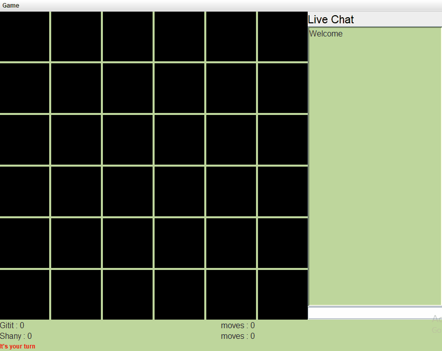
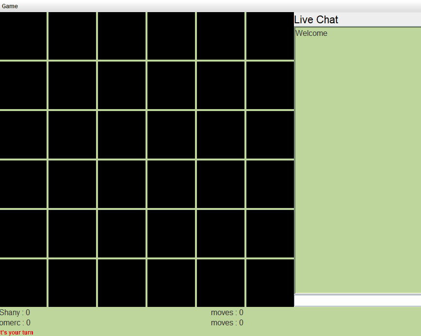
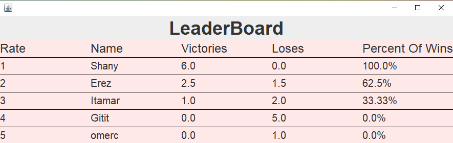
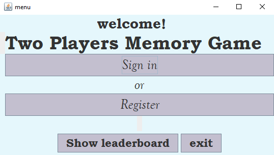
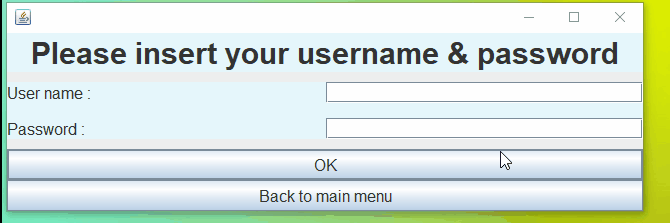

# Memory Game For Two Players

This is a game that originally I created for university task, but i improved it and added more features to gain more experience in this area and for fun.
The game is for two players who share a network.

Developed with JAVA.
The communication works with TCP network protocol.

## Features
1)	Live memory game with opponent on the network
2)  Graphical user interface
3)	Live chat
4)	Display of top players table
5)	UserName Management System

## The Game

Each player in turn flips two cards. If these two cards are identical this player earn a point. 
Number od turnes (moves) are counted for each player.

After all cards are open - the player with more points is the winner. If there is a draw - each player earn half of win.

In the top menu bar we have 3 options :
1) Log out
2) Show The top players table
3) Show my details

## Top Players Table

Display of 5 top players according of their wins percent

## Signing in

This is the main menu that pop first

Then, you must sign in or register with an username and a password

